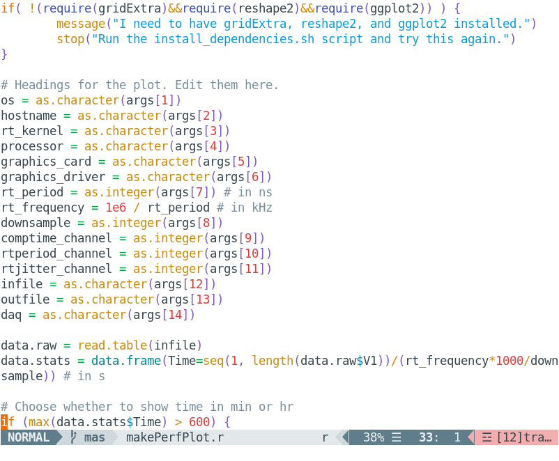

# colorific.vim

Vim theme (dark and light) built to produce readable diffs, unlike the default
theme, and clear syntax highlighting that doesn't use overly bright colors that
make your eyes bleed after prolonged use.

The theme comes with two color sets for 256-color (cterm) and truecolor
terminals. 16-color ones are unsupported, and the theme will not work with
them. To use truecolor (e.g., #ABC123) support, make sure that you have `set
termguicolors` in your vimrc.

The theme comes in two light and dark variants. `light` and `dark` use
blue-grey primary colors, and `light2` and `dark2` use white and black for
deeper contrast. Note that colorific will not override the system background
color, so pick the variant that looks best with your system theme. Colorific
was made with [Adapta](https://github.com/adapta-project/adapta-gtk-theme) and
[Plata](https://gitlab.com/tista500/plata-theme) in mind, so these two may look
best.

Syntax highlighting uses material colors that have been tweaked to lower the
saturation and brightness. Why material colors? Because when you try to find
good highlighting colors out of all the colors available, it helps to have a
starting point.

Another point worth noting is that the theme overrides some of the Vim syntax
highlighter defaults for various languages so that the it appears more
consistent across them.


## Installation

```
git clone https://github.com/sudorook/colorific.vim colorific.vim
cd colorific.vim
./install.sh
```

To install the theme as root, run `sudo ./install.sh` instead.


## Configuration

Add the following lines to your vimrc:
```
let g:colorific_style='dark'
colo colorific
set background=dark
syntax on
```

Use `set background=light` instead if you use a light system theme, and use
`let g:colorific_style='dark2'` or `let g:colorific_style='light2'` to use the
higher-contrast variant.  (If you're not using the `dark2` or `light2`
variants, this line can be omitted.)

Colorific can also be used to color the airline bar. Load the theme by adding
to your vimrc:
```
let g:airline_theme='colorific'
```

Note that if vim is invoked as root, colorific needs to be loaded in
/root/.vimrc.


## Examples

|            | Light                              | Dark                              |
| :---:      | :---:                              | :---:                             |
| CSS        |        |        |
| HTML       |      |      |
| XML        |        |        |
| Ruby       |      |      |
| Python     |  |  |
| C/C++      |        |        |
| R          |            |            |
| Julia      |    |    |
| Perl       |      |      |
| Javascript |  |  |
| Bash       |      |      |
| LaTeX      |    |    |


## Extras

### gitk

Stylings for gitk are available in the gitk/ directory. To set a gitk theme,
copy the file for the desired theme (e.g. gitk-dark2) to a file called
~/.config/git/gitk. The file needs to be renamed as 'gitk.' Symlinks would
work, too.

Note that the `install.sh` script will install all four variants with names
unchanged to ~/.config/git/. To pick one, simply rename/symlink the file.


### tmux

Themes for tmux are available in the tmux/ directory. To use them, edit your
.tmux.conf file to have the line:

```
source-file <path>/<to>/<theme>.tmuxtheme
```

where `<theme>` refers to one of the available variants (light2, dark2, dark,
or light).

Note that the `install.sh` script will copy the themes in tmux/ to the ~/.tmux/
directory. No files need to be renamed for tmux.
