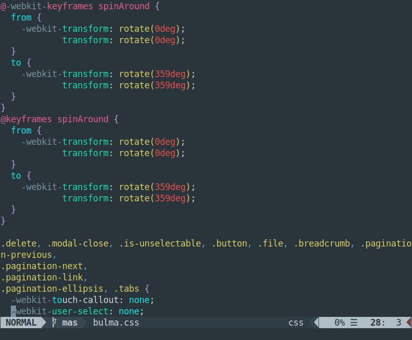

# colorific.vim

Vim theme (dark and light) built to produce readable diffs (unlike the default)
and clear syntax highlighting without using overly bright colors that make your
eyes bleed after prolonged use.

The theme comes with two color sets for 256-color (cterm) and truecolor
terminals. 16-color ones are unsupported, and the theme will not work with
them. To use truecolor (e.g., #ABC123) support, make sure that you have `set
termguicolors` in your vimrc.

Note that the theme doesn't override the system background color, so it may
look odd in some themes. UI elements (Folds, FoldColumns, StatusLines, etc.)
use BlueGrey colors from Google's color palette, so colorific will look best
with system themes that use those colors, such as
[adapta](https://github.com/adapta-project/adapta-gtk-theme).

Syntax highlighting uses material colors that have been tweaked to lower the
saturation and brightness. Why material colors? Because when you try to find
good highlighting colors out of all the colors available, it helps to have a
starting point.

Another point worth noting is that the theme overrides some of the highlighter
defaults for various languages so that appearance is more consistent across
them.


## Installation

```
git clone https://github.com/sudorook/colorific.vim colorific.vim
cd colorific.vim
./install.sh
```

To install the theme as root, run `sudo ./install.sh` instead.


## Configuration

Add the following lines to your vimrc:
```
colo colorific
set background=dark
syntax on
```

Use `set background=light` instead if you use a light system theme.

If you are using airline, load the theme by adding to your vimrc:
```
let g:airline_theme='colorific'
```

Note that if vim is invoked as root, colorific needs to be loaded in
/root/.vimrc.


## Examples

|            | Light                              | Dark                              |
| :---:      | :---:                              | :---:                             |
| CSS        |        |        |
| HTML       |      |      |
| XML        |        |        |
| Ruby       |      |      |
| Python     |  |  |
| C/C++      |        |        |
| R          |            |            |
| Julia      |    |    |
| Perl       |      |      |
| Javascript |  |  |
| Bash       |      |      |
| LaTeX      |    |    |
